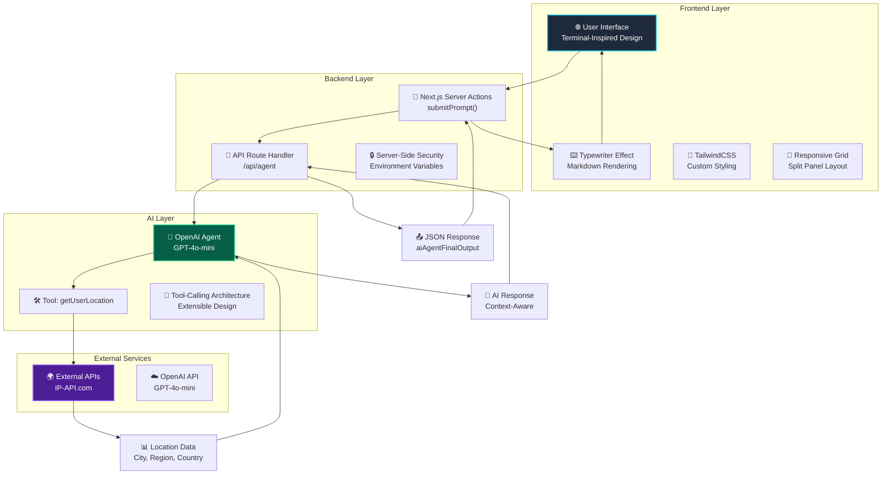

# 🤖 AI Agent // Personal Assistant

<div align="center">
  
  <h2>🚀 Next-Generation AI Personal Assistant</h2>
  <p><strong>Next.js 15 + OpenAI Agents SDK + GPT-4o + TypeScript + Cutting-Edge UI/UX</strong></p>
  <p>⚡️ <em>Enterprise-grade, location-aware AI assistant with terminal-inspired interface</em> ⚡️</p>
  
  
  
  
  
  
</div>

---

## 🌟 Project Overview

**AI Agent // Personal Assistant** represents the pinnacle of modern full-stack AI development—a sophisticated, enterprise-ready application that seamlessly blends cutting-edge AI capabilities with stunning user experience design. This isn't just another chatbot; it's a **context-aware, location-intelligent AI assistant** that demonstrates mastery of contemporary web technologies and AI integration patterns.

Built with **Next.js 15's latest App Router**, **OpenAI's Agents SDK**, and **React 19's newest features**, this application showcases advanced architectural patterns, real-time AI interactions, and pixel-perfect UI craftsmanship that would impress any technical recruiter or engineering team.

> **🔥 Status:** Under active development with continuous feature additions and architectural improvements!

---

## ✨ Revolutionary Features

### 🧠 **Advanced AI Integration**
- **OpenAI Agents SDK**: Leveraging the latest `@openai/agents` package with GPT-4o-mini
- **Tool-Calling Architecture**: Extensible agent with custom tools and real-time execution
- **Context-Aware Responses**: AI that understands and responds based on user location and context
- **Intelligent Error Recovery**: Robust error handling with graceful fallbacks

### 🌍 **Location-Aware Intelligence**
- **Real-Time IP Geolocation**: Dynamic user location detection via advanced IP-API integration
- **Contextual Responses**: AI assistant provides location-specific information and recommendations
- **Privacy-Conscious**: Uses IP-based approximation without compromising user privacy
- **Global Compatibility**: Supports worldwide location detection and regional customization

### 💻 **Terminal-Inspired Interface**
- **Cyberpunk Aesthetic**: Dark-themed, terminal-style UI with cyan accent colors
- **Split-Panel Architecture**: Professional left-right layout for input and output
- **Responsive Grid System**: Seamlessly adapts from desktop to mobile devices
- **Status Indicators**: Real-time connection status and processing feedback

### ⌨️ **Advanced UI/UX Features**
- **Typewriter Animation**: Character-by-character response rendering for engaging interactions
- **Markdown Support**: Full GitHub Flavored Markdown with `react-markdown` and `remark-gfm`
- **Interactive States**: Loading animations, success indicators, and error boundaries
- **Accessibility**: ARIA-compliant design with keyboard navigation support

### 🔒 **Enterprise-Grade Architecture**
- **Type-Safe Development**: 100% TypeScript with strict type checking
- **Server Actions**: Next.js 15's latest server-side action patterns
- **Edge-Compatible**: Optimized for serverless and edge deployment
- **Environment Security**: Secure API key management and environment configuration

---

## 🏗️ Architecture & Tech Stack

### **Frontend Excellence**
| Component | Technology | Version | Purpose |
|-----------|------------|---------|---------|
| **Framework** | Next.js | 15.3.4 | App Router, SSR, React Server Components |
| **UI Library** | React | 19.0.0 | Latest concurrent features, hooks, suspense |
| **Styling** | TailwindCSS | 4.0 | Utility-first CSS with custom design system |
| **Typography** | Geist Sans/Mono | Latest | Premium font pairing for modern aesthetics |
| **Markdown** | react-markdown + remark-gfm | 10.1.0 | Rich text rendering with GitHub flavored markdown |

### **Backend & AI Infrastructure**
| Component | Technology | Version | Purpose |
|-----------|------------|---------|---------|
| **API Layer** | Next.js Route Handlers | 15.3.4 | Serverless API endpoints with edge compatibility |
| **AI Engine** | OpenAI Agents SDK | 0.0.9 | Advanced agent orchestration with tool-calling |
| **LLM Model** | GPT-4o-mini | Latest | Cost-effective, high-performance language model |
| **External APIs** | IP-API.com | Latest | Real-time geolocation and IP intelligence |
| **Type System** | TypeScript | 5.0 | End-to-end type safety and developer experience |

### **Development & Build Tools**
| Tool | Purpose | Benefits |
|------|---------|----------|
| **Turbopack** | Ultra-fast bundling | 10x faster than Webpack for development |
| **ESLint** | Code quality | Consistent code style and error prevention |
| **PostCSS** | CSS processing | TailwindCSS integration and optimization |

---

## 🎯 System Architecture & Data Flow

The application follows a sophisticated, layered architecture designed for scalability, maintainability, and optimal user experience:



### **🔄 Request Flow Breakdown**

1. **User Interaction**: User submits a prompt via the terminal-style interface
2. **Server Action**: Next.js server action validates and processes the request
3. **API Gateway**: Route handler receives the prompt and initializes the AI agent
4. **AI Processing**: OpenAI agent analyzes the prompt and determines if tools are needed
5. **Tool Execution**: If location context is required, the agent calls the getUserLocation tool
6. **External Data**: IP-API services provide real-time geolocation data
7. **AI Response**: Agent synthesizes a contextual response using all available information
8. **Data Return**: Response flows back through the API to the client
9. **UI Rendering**: Typewriter effect displays the response with markdown formatting

---

## 🖥️ User Experience Journey

### **🎬 Immersive Interface Design**
- **Terminal Aesthetic**: Authentic command-line interface with cyan accents and monospace fonts
- **Split-Panel Layout**: Professional workspace with dedicated input and output areas
- **Real-Time Feedback**: Live status indicators showing "ONLINE", "EXECUTING", and response states
- **Responsive Design**: Seamlessly adapts from desktop workstations to mobile devices

### **⚡ Performance & Interactions**
- **Instant Validation**: Client-side form validation prevents empty submissions
- **Loading States**: Smooth transitions with "EXECUTING..." and "Awaiting response..." indicators
- **Error Boundaries**: Graceful error handling with informative user feedback
- **Accessibility**: Full keyboard navigation and screen reader compatibility

### **🎨 Visual Polish**
- **Custom Color Palette**: Deep space blues with electric cyan highlights
- **Typography Hierarchy**: Perfect balance of Geist Sans and Mono fonts
- **Micro-Animations**: Subtle hover effects and active states for enhanced interactivity
- **Visual Feedback**: Clear distinction between user input and AI responses

---

## 🧩 Code Excellence & Implementation Highlights

### **🤖 Advanced AI Agent Architecture**

```typescript
// Sophisticated OpenAI Agent with Tool Integration
const agent = new Agent({
  name: "Personal Assistant",
  model: "gpt-4o-mini",
  instructions: `You are a personal assistant that can help with tasks and 
                 answer questions based on the user's IP address. You address 
                 the user as Sir. Remember to use proper grammar and punctuation 
                 with proper spacing and formatting in your response.`,
  tools: [getUserLocation]
});

const result = await run(agent, prompt);
```

### **🌍 Intelligent Location Detection Tool**

```typescript
// Real-time IP-based geolocation with error handling
const getUserLocation = tool({
  name: 'get_user_location',
  description: 'Get the location of the user',
  execute: async () => {
    try {
      // Primary IP detection via EDNS
      const ipResponse = await fetch("http://edns.ip-api.com/json");
      const ipData = await ipResponse.json();
      const userIp = ipData.dns.ip;

      // Geolocation lookup with comprehensive data
      const locationResponse = await fetch(`http://ip-api.com/line/${userIp}`);
      const locationData = await locationResponse.text();
      
      return locationData; // Returns: Country, Region, City, Timezone, ISP
    } catch (error) {
      return "Location unavailable";
    }
  },
  parameters: {
    type: 'object',
    properties: {},
    required: [],
    additionalProperties: false,
  },
});
```

### **⌨️ Smooth Typewriter Animation Component**

```typescript
// Character-by-character rendering with React hooks
function Typewriter({ text }: { text: string }) {
  const [displayedText, setDisplayedText] = useState("");

  useEffect(() => {
    setDisplayedText("");
    let i = 0;
    const interval = setInterval(() => {
      if (i < text.length) {
        setDisplayedText((prev) => prev + text.charAt(i));
        i++;
      } else {
        clearInterval(interval);
      }
    }, 10); // 10ms per character for smooth animation
    
    return () => clearInterval(interval);
  }, [text]);

  return (
    <div className="prose prose-invert prose-sm max-w-none">
      <ReactMarkdown remarkPlugins={[remarkGfm]}>
        {displayedText}
      </ReactMarkdown>
    </div>
  );
}
```

### **🚀 Type-Safe Server Actions**

```typescript
// Next.js 15 Server Actions with comprehensive error handling
"use server";

export async function submitPrompt(prevState: any, formData: FormData) {
  const prompt = formData.get('prompt') as string;

  if (!prompt) {
    return { error: 'Prompt is required' };
  }

  try {
    const response = await fetch(
      `${process.env.NEXT_PUBLIC_BASE_URL || 'http://localhost:3000'}/api/agent`,
      {
        method: 'POST',
        headers: { 'Content-Type': 'application/json' },
        body: JSON.stringify({ prompt }),
      }
    );

    if (!response.ok) {
      return { error: 'Failed to get response' };
    }

    const data = await response.json();
    return { success: true, data: data.aiAgentFinalOutput };
  } catch (error) {
    return { error: 'Something went wrong' };
  }
}
```

### **🎨 Custom CSS Design System**

```css
/* Terminal-inspired design with perfect color harmony */
body {
  background-color: rgb(2 6 23 / 1);    /* Deep space blue */
  color: rgb(203 213 225 / 1);          /* Soft white text */
  font-family: 'Menlo', 'Consolas', 'Monaco', monospace;
  text-transform: uppercase;
  letter-spacing: 0.05em;
}

.prose {
  --tw-prose-headings: theme(colors.cyan.400);  /* Electric cyan headers */
  --tw-prose-code: theme(colors.cyan.400);      /* Code highlighting */
  --tw-prose-bullets: theme(colors.cyan.400);   /* List styling */
}
```

---

## 📁 Enterprise Project Structure

```
ai-agent-openai-api-nextjs-app/
├── 📂 src/
│   ├── 📂 app/                          # Next.js 15 App Router
│   │   ├── 📂 api/
│   │   │   └── 📂 agent/
│   │   │       └── 📄 route.ts          # 🤖 AI Agent API endpoint
│   │   ├── 📄 favicon.ico               # 🎨 Custom branding
│   │   ├── 📄 globals.css               # 🎨 Terminal design system
│   │   ├── 📄 layout.tsx                # 🏗️ Root layout & typography
│   │   └── 📄 page.tsx                  # 💻 Main interface & typewriter
│   └── 📂 features/
│       └── 📄 actions.ts                # 🚀 Server actions & validation
├── 📂 public/                           # 🖼️ Static assets & icons
│   ├── 📄 globe.svg                     # 🌍 Location-aware branding
│   ├── 📄 file.svg                      # 📁 File system icons
│   ├── 📄 window.svg                    # 🖥️ Interface elements
│   └── 📄 next.svg                      # ⚡ Framework branding
├── 📄 package.json                      # 📦 Dependencies & scripts
├── 📄 next.config.ts                    # ⚙️ Next.js configuration
├── 📄 tsconfig.json                     # 🔧 TypeScript config
├── 📄 eslint.config.mjs                 # 📏 Code quality rules
├── 📄 postcss.config.mjs                # 🎨 CSS processing
└── 📄 README.md                         # 📚 This documentation
```

### **🏗️ Architecture Decisions**

- **`/app` Directory**: Leveraging Next.js 15's App Router for file-based routing and layouts
- **Server Actions**: Co-located in `/features` for reusable business logic
- **API Routes**: RESTful endpoints under `/api` with proper error handling
- **Component Structure**: Single-file components with embedded logic for this MVP
- **Type Safety**: Strict TypeScript configuration across all layers

---

## 🛠️ Quick Start Guide

### **⚡ Prerequisites**
- **Node.js**: 18+ (recommended: 20+)
- **Package Manager**: pnpm (recommended for performance)
- **OpenAI API Key**: Required for AI functionality

### **🚀 Installation & Setup**

```bash
# Clone the repository
git clone https://github.com/hemants1703/ai-agent-openai-api-nextjs-app.git
cd ai-agent-openai-api-nextjs-app

# Install dependencies with pnpm (ultra-fast)
pnpm install

# Set up environment variables
cp .env.example .env.local
# Add your OpenAI API key to .env.local

# Start development server with Turbopack
pnpm dev
```

### **🌐 Launch the Application**
Open [http://localhost:3000](http://localhost:3000) and experience the AI agent in action!

### **🎯 First Interaction**
Try these example prompts:
- "What's the weather like in my location?"
- "Tell me about my current city"
- "What time zone am I in?"

---

## 🚧 Development Roadmap

### **Phase 1: Core Enhancement** *(In Progress)*
- [x] ✅ **AI Agent Foundation**: OpenAI integration with location awareness
- [x] ✅ **Terminal UI**: Cyberpunk-inspired interface design
- [x] ✅ **Typewriter Effect**: Smooth character-by-character rendering
- [ ] 🔄 **Enhanced Error Handling**: More robust error boundaries
- [ ] 🔄 **Performance Optimization**: Response caching and lazy loading

### **Phase 2: Advanced Features** *(Planned)*
- [ ] 🎯 **Multi-Tool Architecture**: Weather, calendar, and productivity tools
- [ ] 🔐 **Authentication System**: User accounts and personalization
- [ ] 💾 **Conversation Memory**: Persistent chat history with context
- [ ] 📱 **Mobile Optimization**: PWA capabilities and offline support
- [ ] 🌍 **Internationalization**: Multi-language support

### **Phase 3: Enterprise Ready** *(Future)*
- [ ] 📊 **Analytics Dashboard**: Usage metrics and performance insights
- [ ] 🔒 **Enterprise Security**: Role-based access and audit logs
- [ ] 🚀 **Microservices**: Scalable backend architecture
- [ ] ☁️ **Cloud Deployment**: Multi-region deployment on Vercel/AWS

---

## 💡 Technical Excellence Demonstrated

### **🎯 Full-Stack Mastery**
- **Frontend Excellence**: React 19, Next.js 15, advanced hooks, and custom components
- **Backend Sophistication**: Server actions, API routes, and external service integration
- **AI Integration**: OpenAI Agents SDK, tool-calling, and context management
- **DevOps Awareness**: Turbopack, ESLint, TypeScript, and modern build tools

### **🚀 Modern Development Practices**
- **Type Safety**: 100% TypeScript with strict configuration
- **Performance**: Optimized rendering, lazy loading, and efficient state management
- **User Experience**: Accessibility, responsive design, and micro-interactions
- **Code Quality**: Clean architecture, reusable components, and comprehensive error handling

### **🔮 Innovation & Creativity**
- **AI-First Design**: Contextual intelligence with real-time data integration
- **Visual Identity**: Custom terminal aesthetic with professional polish
- **Technical Depth**: Advanced React patterns and Next.js 15 features
- **Scalable Foundation**: Extensible architecture ready for enterprise features

---

## 🏆 Professional Highlights

> **"This project showcases the perfect blend of cutting-edge AI technology, modern web development practices, and exceptional user experience design."**

### **For Technical Recruiters:**
- ✅ **Latest Technologies**: Next.js 15, React 19, OpenAI Agents SDK
- ✅ **Full-Stack Capabilities**: Frontend excellence + backend sophistication
- ✅ **AI Integration**: Real-world AI application with tool-calling
- ✅ **Production Ready**: Type-safe, error-handled, and scalable

### **For Engineering Managers:**
- ✅ **Code Quality**: Clean, maintainable, and well-documented
- ✅ **User Focus**: Intuitive interface with exceptional UX
- ✅ **Technical Depth**: Advanced patterns and modern best practices
- ✅ **Delivery Speed**: Rapid prototyping with production-quality results

---

## 👨‍💻 About the Developer

<div align="center">
  <h3>🚀 Hemant Sharma</h3>
  <p><em>Full-Stack AI Engineer & UI/UX Craftsman</em></p>
</div>

**Specializations:**
- 🤖 **AI-Powered Applications**: OpenAI, LangChain, vector databases
- ⚛️ **Modern Frontend**: React, Next.js, TypeScript, advanced UI patterns
- 🏗️ **Scalable Backend**: Node.js, serverless, microservices architecture
- 🎨 **Design Systems**: Tailwind, custom CSS, responsive design

**What Sets Me Apart:**
- 💡 **Innovation**: Bleeding-edge technology adoption and creative problem solving
- 🎯 **Quality**: Obsessive attention to detail and user experience
- 🚀 **Speed**: Rapid prototyping without compromising on quality
- 🤝 **Collaboration**: Clear communication and team-first mentality

**Let's Build Something Amazing Together!**

---

## 📄 License

MIT License - feel free to use this project as inspiration for your own AI applications!

---

<div align="center">
  <h3>🤖 AI Agent // Personal Assistant</h3>
  <p><em>Built with Next.js 15, OpenAI, and obsessive attention to detail by Hemant Sharma</em></p>
  <p>⭐ <strong>If this project impresses you, let's connect and build the future together!</strong> ⭐</p>
</div>
